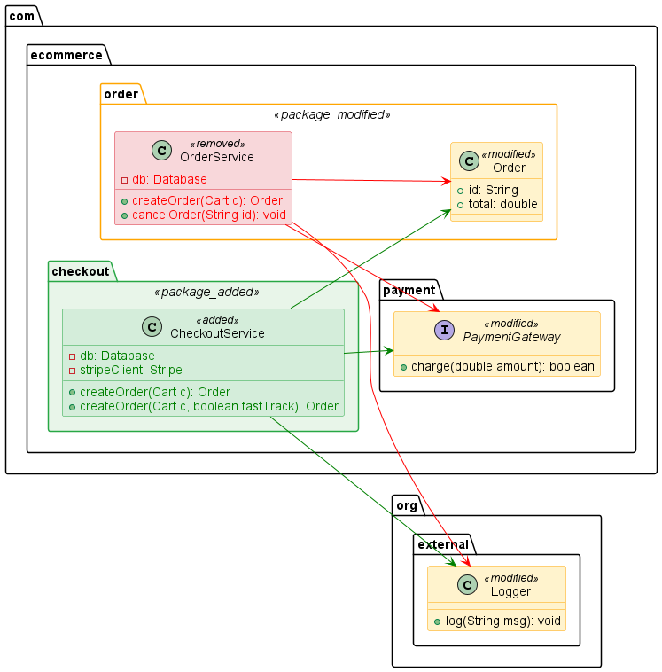
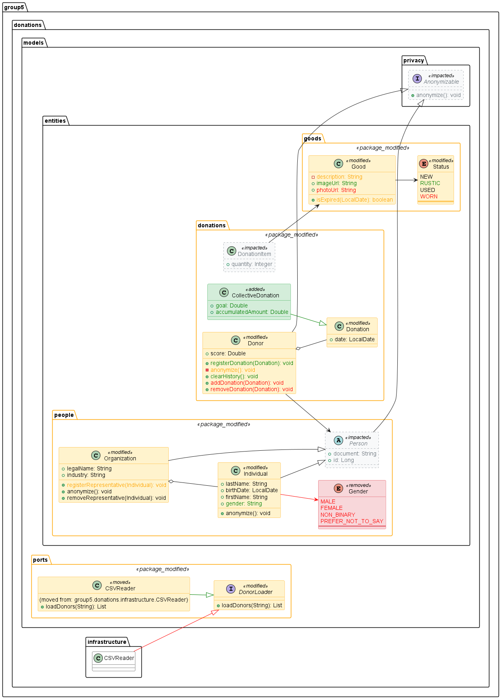

# SemanticUMLDiff

A deterministic semantic UML diff system for GitHub Pull Requests.

This tool automatically detects changes in your codebase's architectural structure by comparing semantic UML models, eliminating whitespace noise and irrelevant changes, and publishing visually clean structural diffs directly to your Pull Requests and Discord channels.



### Complete Demo

To see a complete, fully featured semantic diff on a complex domain model (including method rename detection, class movement, package changes, enum modifications, and contextual graph reduction), expand the section below:

<details>
<summary><b>🔍 Click to expand the Complete Semantic Diff Diagram</b></summary>



</details>

## Overview

SemanticUMLDiff:
1. Takes existing PlantUML definitions generated from your base branch and PR branch.
2. Parses them into semantic domain models.
3. Automatically detects renamed or moved classes using structural heuristics.
4. Ignores completely unrelated external packages or 3rd party libraries.
5. Emits a beautifully rendered diff subgraph showing *only* what changed and its immediate architectural context.

## Key Features

- **Semantic Comparison**: Diffing models instead of text guarantees that changing order or indentation of methods will not generate a false positive diff.
- **Advanced Heuristics**: Detects renamed classes/packages if their internal members share 75% or more similarity. Accurately diffs method overloads using full signatures.
- **Customizable Graph Reducer**: Filter out unrelated noise. Shows the changed nodes and a configurable `context_depth` (default: 1) of neighbors to understand the impact of the change.
- **Beautiful Theming**: Injects custom, sleek, modern CSS-like styling natively into the generated PUML via stereotypes.
- **GitHub Action & Discord**: Drop it right into your CI/CD pipeline and receive architectural diffs as comments in PRs and rich embeds in Discord channels.

## Usage

Use it as a GitHub Action in your CI/CD pipeline.

```yaml
steps:
  - name: Run SemanticUMLDiff
    uses: tsorren/SemanticUMLDiff@main
    with:
      base_uml_dir: ./base_uml
      pr_uml_dir: ./pr_uml
      github_token: ${{ secrets.GITHUB_TOKEN }}
      discord_webhook_url: ${{ secrets.DISCORD_WEBHOOK }}
      diagram_spacing: 30
      context_depth: 1
```

## How It Works

See our specifications and architectural design documents inside the `specs/` directory:
- [Domain Concepts](specs/01-domain.md)
- [Architecture](specs/02-architecture.md)
- [Workflow](specs/03-workflow.md)

## Local Development & Testing

This project uses `uv` for Python dependency management.

To run the entire test suite (including unit tests and the end-to-end integration test):
```bash
uv run pytest
```

To run quality control checks (linting, formatting and typing):
```bash
uv run ruff check src tests
uv run mypy src tests
```

To regenerate the visual demo diagrams:
```bash
uv run python generate_demo.py
```
