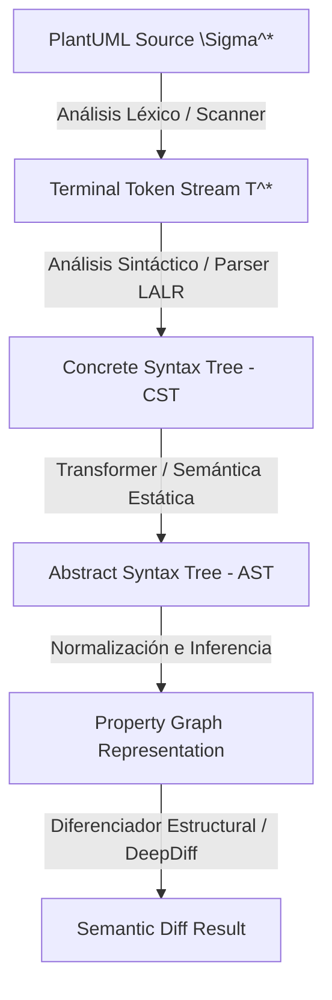

# Plan de Implementación de Alto Nivel: Migración a Enfoque de Compiladores (Lark & DeepDiff)

Este documento detalla el análisis de requerimientos, la especificación de diseño arquitectónico de alto nivel y los fundamentos teóricos para migrar el motor de parsing y diff semántico de `SemanticUMLDiff` hacia un enfoque formal basado en teoría de compiladores, sintaxis y semántica de lenguajes de programación y comparación de grafos estructurales.

---

## 1. Motivación y Objetivos

El sistema actual realiza un preprocesamiento basado en reemplazos de texto y expresiones regulares para parsear diagramas PlantUML. Aunque robusto para el subset de diagramas actual, este enfoque presenta limitaciones intrínsecas de extensibilidad y es propenso a fallas ante sintaxis complejas (como genéricos anidados, inicializaciones de variables complejas o comentarios de bloque exóticos).

### Objetivos Principales:
- **Lexer & Parser Formales:** Reemplazar el motor basado en regex por un analizador sintáctico formal que genere un Árbol de Sintaxis Abstracta (AST) lineal y estructurado.
- **AST mediante Lark:** Utilizar la biblioteca `Lark` para definir una gramática EBNF clara, mantenible y extensible para PlantUML.
- **Comparación Estructural con DeepDiff:** Sustituir la comparación ad-hoc de clases y firmas por una comparación recursiva profunda sobre una representación normalizada del AST y del grafo UML utilizando `DeepDiff`.
- **Compatibilidad con las Reglas de Negocio:** Mantener de forma íntegra todas las características actuales (detección de clases movidas, estilos visuales, filtrado de parámetros, cálculo de complejidad, etc.).
- **Diseño SOLID:** Garantizar la modularidad (SRP) y extensibilidad (OCP) para facilitar la incorporación futura de nuevos elementos UML.

---

## 2. Análisis de Requerimientos y Casos de Uso

El sistema debe procesar diagramas PlantUML y calcular su diferencia semántica (no textual) de forma 100% determinista. Para lograr esto con un enfoque de compiladores, debemos descomponer el flujo en etapas claras de análisis sintáctico (AST) y comparación de grafos de propiedades.

### Requerimientos Estructurales a Soportar:
- **Entidades:** Clases, clases abstractas, interfaces y enums, representadas con sus namespaces (FQN) y tipos semánticos correspondientes.
- **Miembros:** Atributos (campos) y métodos con sus respectivas firmas completas, visibilidad (`+`, `-`, `#`, `~`), modificadores (`static`, `abstract`) y valores iniciales opcionales.
- **Relaciones:** Herencia (`--|>`), asociación (`-->`), composición (`*--`), y agregación (`o--`), incluyendo multiplicidades en los extremos.
- **Agrupamiento Físico:** Soporte a bloques `package` que anidan lógicamente elementos y relaciones.

---

## 3. Teoría de Ciencias de la Computación Aplicada

Para lograr un sistema robusto, determinista y extensible, la arquitectura se divide en fases clásicas de un compilador (frontend y middle-end):



### 3.1 Jerarquía de Chomsky y Gramáticas Libres de Contexto (CFG)
El subset de PlantUML soportado pertenece a los **Lenguajes Libres de Contexto (Tipo 2 de la Jerarquía de Chomsky)**. Se define mediante una gramática formal de cuatro tuplas $G = (V, \Sigma, R, S)$ donde:
- $V$ es el conjunto de variables no terminales (ej. `package`, `element`, `method`).
- $\Sigma$ es el conjunto de terminales (tokens generados por el Scanner).
- $R$ es el conjunto de reglas de producción (sintaxis formal).
- $S$ es el símbolo inicial (`start`).

Al ser un lenguaje libre de contexto, se puede parsear eficientemente en tiempo lineal $O(N)$ utilizando un autómata de pila determinista (Deterministic Pushdown Automaton - DPDA), específicamente a través de un algoritmo de parseo **LALR(1)** (Look-Ahead Left-to-Right, Rightmost derivation con 1 token de anticipación).

---

## 4. Arquitectura del Compilador UML

El nuevo pipeline de procesamiento se estructurará en componentes modulares independientes:

### 4.1 Analizador Léxico (Scanner / Lexer)
El Scanner lee la secuencia de caracteres del archivo PlantUML ($\Sigma^*$) y la mapea a un flujo de tokens ($T^*$).
- **Reglas Regulares y Autómatas Finitos (DFA):** Cada token se define mediante una Expresión Regular que se compila internamente en un Autómata Finito Determinista (DFA).
- **Categorización de Tokens:**
  - *Identificadores y FQNs:* Patrones de palabras y namespaces jerárquicos (`[a-zA-Z_]\w*`).
  - *Terminales de Visibilidad:* `+`, `-`, `#`, `~` (mapeados a tokens de tipo `VISIBILITY`).
  - *Modificadores y Palabras Clave:* `{static}`, `{abstract}`, `{field}`, `{method}`, `class`, `interface`, `enum`.
  - *Operadores de Relación:* Expresiones regulares que capturan flechas de relación (`-->`, `--|>`, `*--`, `o--`).
  - *Tolerancia y Omisión:* El Scanner debe ignorar los espacios en blanco (`WS`) y comentarios mediante directivas específicas (`%ignore WS`), evitando contaminar el flujo de tokens.

### 4.2 Analizador Sintáctico (Parser)
El Parser toma el flujo de tokens y construye el Árbol de Sintaxis Concreta (CST) según las producciones de la gramática.
- **Algoritmo LALR(1):** Evita la ambigüedad en la precedencia de reglas mediante un token de lookahead.
- **Resolución de Conflictos Shift-Reduce:** El diseño de la gramática debe evitar ambigüedades en la asociación de miembros (atributos vs métodos) y namespaces anidados. Por ejemplo, al leer `FQN IDENTIFIER` frente a `FQN "<"` se utiliza la anticipación para resolver si se trata de un atributo type-first o un genérico.
- **Gramática de Tipos Recursiva:** La regla de tipos debe ser autoreferencial para soportar genéricos aninados (ej. `List<Map<String, Integer>>` se deriva recursivamente como `Type -> FQN '<' Type (',' Type)* '>'`).

### 4.3 Transformador Sintáctico y Semántica Estática (AST)
El CST contiene nodos sintácticos irrelevantes para la lógica de negocio (como las llaves `{}` o palabras de inicio `@startuml`). El transformador (AST Transformer) limpia el CST y construye el **Árbol de Sintaxis Abstracta (AST)**:
- **Construcción de Nodos AST:** Mapeo de subárboles a objetos inmutables (`UMLClass`, `UMLAttribute`, `UMLMethod`, `UMLRelation`).
- **Semántica Estática (Análisis de Namespaces y Ámbito):**
  - *Resolución de Scoping:* Si un elemento se declara dentro de un bloque `package "com.pkg"`, cualquier clase `User` interna debe adquirir el FQN `com.pkg.User` de forma estática en su definición AST.
  - *Binding de Relaciones:* Validación de que los extremos de una relación (`source` y `target`) correspondan a identificadores sintácticamente válidos.

### 4.4 Comparador Semántico y Diferenciador de Grafos (DeepDiff)
Debido a que un diagrama UML es un grafo (nodos = clases, aristas = relaciones), la comparación no puede ser una simple resta lineal. Se modela como una **Isomorfismo de Grafos de Propiedades**:
- **Equivalencia Estructural vs Nominal:** El motor debe comparar propiedades estructurales (métodos, atributos y sus tipos) más allá del nombre del archivo o su orden en el texto.
- **DeepDiff sobre Representaciones Canónicas:**
  - El AST se normaliza ordenando determinísticamente las colecciones de clases, atributos, métodos y relaciones por sus claves FQN.
  - Se serializa a un diccionario de Python.
  - El motor ejecuta `DeepDiff` para calcular la diferencia de grafos en $O(V + E)$ promedio, extrayendo agregados, removidos y valores modificados a nivel de campo.

---

## 5. Gramática EBNF Propuesta (Lark)

Se utilizará una gramática libre de contexto expresada en notación EBNF. A continuación se define el subset principal:

```ebnf
?start: document

document: "@startuml" (element | relationship | package | setting)* "@enduml"

setting: "skinparam" IDENTIFIER IDENTIFIER
       | "set" IDENTIFIER IDENTIFIER

package: "package" ESCAPED_STRING [stereo] "{" (element | relationship)* "}"

element: kind ESCAPED_STRING [ "as" IDENTIFIER ] [stereo] [ "{" member* "}" ]
       | kind IDENTIFIER [stereo] [ "{" member* "}" ]

kind: "class" | "abstract class" | "interface" | "enum"

stereo: "<<" IDENTIFIER ">>"

member: method | attribute

method: [visibility] [modifiers] IDENTIFIER "(" [parameters] ")" [ ":" type ]
attribute: [visibility] [modifiers] IDENTIFIER [ ":" type ] [ "=" value ]
         | [visibility] [modifiers] type IDENTIFIER [ "=" value ]

visibility: "+" | "-" | "#" | "~"
modifiers: "{static}" | "{abstract}" | "{method}" | "{field}"

parameters: parameter ("," parameter)*
parameter: IDENTIFIER ":" type
         | type IDENTIFIER
         | type

type: FQN [ "<" type ("," type)* ">" ]

value: ESCAPED_STRING | NUMBER | IDENTIFIER

relationship: FQN [ESCAPED_STRING] arrow [ESCAPED_STRING] FQN [ ":" label ]
arrow: /[-.o*<|]+/

IDENTIFIER: /[a-zA-Z_][a-zA-Z0-9_]*/
FQN: /[a-zA-Z_][a-zA-Z0-9_]*(\.[a-zA-Z_][a-zA-Z0-9_]*)*/
label: /[^\n]+/

%import common.ESCAPED_STRING
%import common.NUMBER
%import common.WS
%ignore WS
```

---

## 6. Estrategia de Diff Semántico con DeepDiff

Para aplicar `DeepDiff`, los modelos de datos se transforman en una estructura jerárquica indexada por claves canónicas FQN (Fully Qualified Names).

### Estructura de Diccionario Normalizado:
```json
{
  "classes": {
    "grupo5.donaciones.models.entities.beneficiarios.DonacionAsignada": {
      "kind": "class",
      "visibility": "+",
      "attributes": {
        "fechaAsignacion": {
          "type": "LocalDateTime",
          "visibility": "+"
        }
      },
      "methods": {
        "getCantidad()": {
          "return_type": "Integer",
          "visibility": "+",
          "parameters": []
        }
      }
    }
  },
  "relations": {
    "grupo5.donaciones.models.entities.beneficiarios.DonacionAsignada->grupo5.donaciones.models.entities.donaciones.segmentaciones.DonacionIndependiente": {
      "relation_type": "association",
      "multiplicity_source": "",
      "multiplicity_target": "donacionIndependiente"
    }
  }
}
```

### Mapeo de Resultados de DeepDiff:
- **`dictionary_item_added`**: Mapea a clases, métodos, atributos o relaciones agregadas (`ADDED`).
- **`dictionary_item_removed`**: Mapea a clases, métodos, atributos o relaciones eliminadas (`REMOVED`).
- **`values_changed`**: Mapea a modificaciones de atributos (cambio de visibilidad, tipo) o métodos (cambio de tipo de retorno, visibilidad, etc.), generando un `DiffItem` de tipo `MODIFIED`.

---

## 7. Heurísticas y Post-procesamiento

La salida de DeepDiff nos da la lista cruda de adiciones, eliminaciones y cambios de valor. Para satisfacer las reglas de negocio avanzadas de `SemanticUMLDiff`, aplicamos post-procesadores secuenciales (SOLID/SRP):
1. **Moved Class Detector:** Toma las clases marcadas como agregadas (`ADDED`) y eliminadas (`REMOVED`). Si coinciden en nombre corto y cumplen un umbral de similitud en sus métodos/atributos (>= 50% similitud de nombres o >= 75% similitud de firmas), se unifican como una clase movida (`MODIFIED` con contexto `"moved"`).
2. **Method Rename Detector:** Si una clase tiene un método eliminado y uno agregado con firmas de tipos idénticas, y cumplen la métrica de similitud de nombre (>= 70% similitud), se fusionan en un único cambio de renombre (`MODIFIED`), registrando el método original y el nuevo.

---

## 8. Diseño SOLID y Modularidad

1. **Single Responsibility Principle (SRP):**
   - El parser formal (`PlantUMLParser`) se encarga únicamente de compilar texto a AST.
   - El transformador sintáctico traduce de Lark Tree a Domain Model.
   - El motor de diff (`DeepDiffEngine`) procesa la diferencia estructural sobre diccionarios normalizados.
2. **Open/Closed Principle (OCP):**
   - La gramática EBNF puede extenderse para soportar nuevos diagramas u opciones PlantUML sin alterar el motor de diff ni el renderer visual.
3. **Dependency Inversion Principle (DIP):**
   - El motor de Diff dependerá de la abstracción de diccionarios serializados estructurados, independizándolo del formato textual original de entrada.

---

## 9. Criterios de Aceptación del Compilador

El nuevo motor basado en compiladores se considerará exitoso si:
1. **Determinismo:** El hashing de los diccionarios serializados de modelos idénticos produce el mismo hash SHA-256 de forma consistente.
2. **Compatibilidad Visual:** La salida de PlantUML del pipeline integrado resalta de forma exacta los cambios de tipo y visibilidad en naranja, adiciones en verde y eliminaciones en rojo.
3. **Resiliencia ante Sintaxis Compleja:** Parseo exitoso de estructuras genéricas con múltiples parámetros y anidamientos (`Map<String, List<Tuple<int, double>>>`) sin provocar excepciones sintácticas.

---

## 10. Siguientes Pasos (Hacia Bajo Nivel)

- Definir las clases específicas de Lark Transformer.
- Detallar los casos de prueba sintáctica.
- Estructurar el mapeo detallado de claves de diccionarios para DeepDiff.
