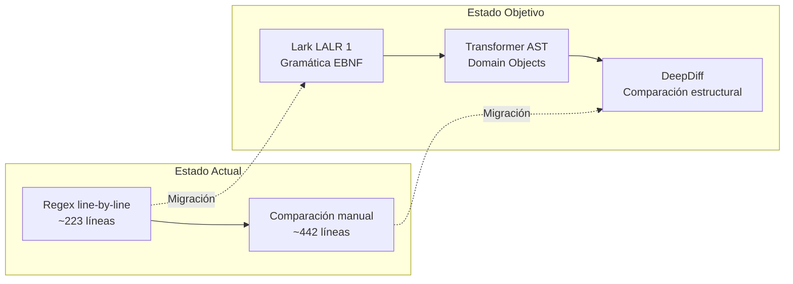
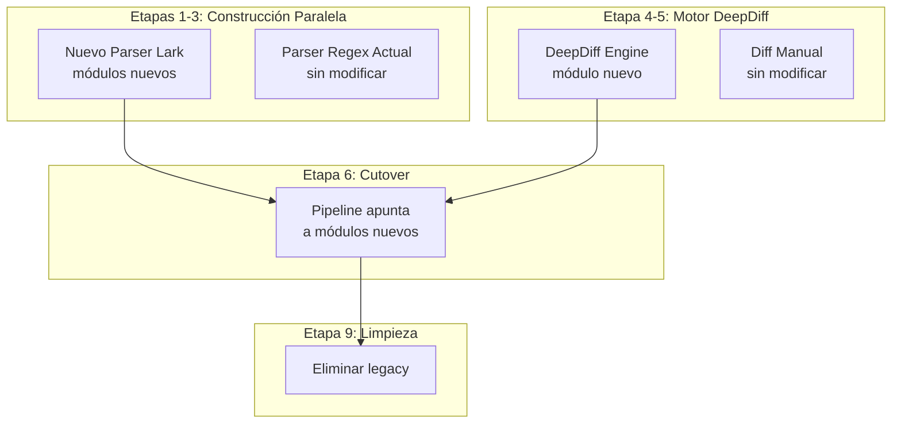
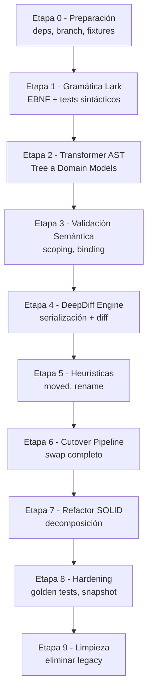

# Plan de Implementación Iterativo: Migración a Lark & DeepDiff

> **Versión**: 1.0  
> **Fecha**: 2026-06-13  
> **Documentos fuente**: [high_level_uml_compiler_plan.md](file:///C:/Users/Pc/Documents/DDS/SemanticUMLDiff/docs/high_level_uml_compiler_plan.md), [detailed_uml_compiler_plan.md](file:///C:/Users/Pc/Documents/DDS/SemanticUMLDiff/docs/detailed_uml_compiler_plan.md)  
> **Especificaciones vigentes**: [SPEC.md](file:///C:/Users/Pc/Documents/DDS/SemanticUMLDiff/SPEC.md), [GEMINI.md](file:///C:/Users/Pc/Documents/DDS/SemanticUMLDiff/GEMINI.md)

---

## Índice

1. [Resumen Ejecutivo](#1-resumen-ejecutivo)
2. [Diagnóstico del Estado Actual](#2-diagnóstico-del-estado-actual)
3. [Principios de Migración](#3-principios-de-migración)
4. [Mapa de Dependencias entre Etapas](#4-mapa-de-dependencias-entre-etapas)
5. [Etapa 0 — Preparación y Estabilización](#etapa-0--preparación-y-estabilización)
6. [Etapa 1 — Gramática Lark y Parser LALR(1)](#etapa-1--gramática-lark-y-parser-lalr1)
7. [Etapa 2 — Transformer AST y Modelos de Dominio](#etapa-2--transformer-ast-y-modelos-de-dominio)
8. [Etapa 3 — Validación Semántica Estática](#etapa-3--validación-semántica-estática)
9. [Etapa 4 — Motor de Diff con DeepDiff](#etapa-4--motor-de-diff-con-deepdiff)
10. [Etapa 5 — Heurísticas Avanzadas (Post-DeepDiff)](#etapa-5--heurísticas-avanzadas-post-deepdiff)
11. [Etapa 6 — Integración del Pipeline y Cutover](#etapa-6--integración-del-pipeline-y-cutover)
12. [Etapa 7 — Refactorización SOLID Final](#etapa-7--refactorización-solid-final)
13. [Etapa 8 — Hardening, Regresiones y Golden Tests](#etapa-8--hardening-regresiones-y-golden-tests)
14. [Etapa 9 — Limpieza, Documentación y Eliminación de Código Legacy](#etapa-9--limpieza-documentación-y-eliminación-de-código-legacy)
15. [Matriz de Riesgos y Mitigación](#15-matriz-de-riesgos-y-mitigación)
16. [Checklist de Reglas Mandatorias](#16-checklist-de-reglas-mandatorias)

---

## 1. Resumen Ejecutivo

Este plan define la migración del motor de parsing y diff semántico de `SemanticUMLDiff` desde su implementación actual basada en **expresiones regulares manuales y comparación ad-hoc** hacia un enfoque formal de compiladores utilizando **Lark LALR(1)** para el análisis sintáctico y **DeepDiff** para la comparación estructural profunda.

### Alcance de la Migración



### Módulos Afectados

| Módulo | Archivo Actual | Acción |
|--------|---------------|--------|
| Parser | [plantuml_parser.py](file:///C:/Users/Pc/Documents/DDS/SemanticUMLDiff/src/parser/plantuml_parser.py) | **Reemplazo completo** |
| Preprocessor | [preprocessor.py](file:///C:/Users/Pc/Documents/DDS/SemanticUMLDiff/src/parser/preprocessor.py) | **Reescritura parcial** |
| Normalization | [normalization.py](file:///C:/Users/Pc/Documents/DDS/SemanticUMLDiff/src/parser/normalization.py) | **Integración en Transformer** |
| Diff Engine | [compute.py](file:///C:/Users/Pc/Documents/DDS/SemanticUMLDiff/src/diff/compute.py) | **Reemplazo del motor de comparación** |
| Complexity | [complexity.py](file:///C:/Users/Pc/Documents/DDS/SemanticUMLDiff/src/diff/complexity.py) | Sin cambios |
| Domain Models | [models.py](file:///C:/Users/Pc/Documents/DDS/SemanticUMLDiff/src/domain/models.py) | **Extensión** (parámetros estructurados) |
| Diff Models | [diff_models.py](file:///C:/Users/Pc/Documents/DDS/SemanticUMLDiff/src/domain/diff_models.py) | Sin cambios |
| Graph Reducer | [reducer.py](file:///C:/Users/Pc/Documents/DDS/SemanticUMLDiff/src/graph/reducer.py) | Sin cambios |
| Renderer | [puml_renderer.py](file:///C:/Users/Pc/Documents/DDS/SemanticUMLDiff/src/render/puml_renderer.py) | Ajustes menores |
| Member Renderer | [member_renderer.py](file:///C:/Users/Pc/Documents/DDS/SemanticUMLDiff/src/render/member_renderer.py) | Ajustes menores |
| Pipeline | [pipeline.py](file:///C:/Users/Pc/Documents/DDS/SemanticUMLDiff/src/pipeline.py) | **Adaptación** |
| Main | [main.py](file:///C:/Users/Pc/Documents/DDS/SemanticUMLDiff/src/main.py) | Sin cambios |

### Módulos NO Afectados (Invariantes)

- `src/integrations/` — GitHub, Discord, PlantUML, Hosting
- `src/render/themes.py` — Motor de temas CSS
- `src/domain/render_models.py` — `RenderSpec`
- `src/domain/integration_models.py` — `ModuleResult`, `IntegrationConfig`

---

## 2. Diagnóstico del Estado Actual

### 2.1 Parser Actual: Limitaciones Críticas

El parser actual en [plantuml_parser.py](file:///C:/Users/Pc/Documents/DDS/SemanticUMLDiff/src/parser/plantuml_parser.py) (~223 líneas) procesa PlantUML línea por línea con 3 expresiones regulares compiladas:

| Componente | Regex | Limitación Identificada |
|-----------|-------|------------------------|
| Entidades | `re_entity` | No soporta `as ALIAS`, estereotipos, ni package-scoping |
| Métodos | `re_method` | **No se usa**; parsing manual post-strip de modificadores |
| Relaciones | `re_relation` | No parsea labels de relación ni flechas complejas |

**Problemas de diseño detectados:**
1. **Parámetros como strings crudos**: `UMLMethod.parameters` almacena `Tuple[str, ...]` con strings como `"param1: Map<String, Integer>"` en vez de objetos estructurados.
2. **Modificadores descartados**: `{abstract}`, `{static}` se stripean de la línea pero **no se almacenan** en el campo `modifiers` del modelo.
3. **Package tracking inexistente**: Las declaraciones `package X { }` se consumen silenciosamente; las clases internas no adquieren su FQN correcto del namespace del package.
4. **Normalización desacoplada**: `normalize_model()` existe en [normalization.py](file:///C:/Users/Pc/Documents/DDS/SemanticUMLDiff/src/parser/normalization.py) pero **no se invoca en el pipeline de producción**, solo en tests.
5. **Sin reporte de errores**: Líneas no parseables se ignoran silenciosamente.

### 2.2 Motor de Diff Actual: Complejidad Excesiva

[compute.py](file:///C:/Users/Pc/Documents/DDS/SemanticUMLDiff/src/diff/compute.py) (~442 líneas) es una "función Dios" ya parcialmente modularizada:

```
compute_diff()
  ├── _detect_root_package()          ← LCP de FQNs
  ├── _filter_internal_classes()      ← Filtro por root_package
  ├── _detect_moved_classes()         ← Jaccard 75%/50%
  ├── _compare_class_additions_removals()
  ├── _compare_existing_classes_members()
  │     └── _compare_members()        ← 4 fases de matching: firma, rename, residuos, comunes
  ├── _compare_packages()
  └── _compare_relations()
```

**Deuda técnica identificada:**
- `difflib` y `collections.defaultdict` importados dentro del cuerpo de funciones (líneas 333, 373)
- La función `_compare_members` (~180 líneas) implementa 4 fases de matching secuencial con lógica de rename embebida
- El `method_parameter_style` es un concern transversal que cruza diff y render

### 2.3 Contratos de Test Críticos (Invariantes de Regresión)

| Test | Archivo | Contrato |
|------|---------|----------|
| **Golden E2E Donaciones** | [test_donaciones_integration.py](file:///C:/Users/Pc/Documents/DDS/SemanticUMLDiff/tests/integration/test_donaciones_integration.py) | 60+ assertions exactas sobre PUML final, **321 puntos, "Media 🟡"** |
| Complejidad | [test_complexity.py](file:///C:/Users/Pc/Documents/DDS/SemanticUMLDiff/tests/diff/test_complexity.py) | Pesos por defecto y clasificación por thresholds |
| Diseño visual | [test_design_constraints.py](file:///C:/Users/Pc/Documents/DDS/SemanticUMLDiff/tests/render/test_design_constraints.py) | Visibilidad fuera de `<color>`, sin `<strike>`, sin paquetes vacíos |
| Parser edge cases | [test_edge_cases.py](file:///C:/Users/Pc/Documents/DDS/SemanticUMLDiff/tests/parser/test_edge_cases.py) | Interfaces, enums, modificadores, package blocks |

> [!CAUTION]
> **Contrato sagrado**: La migración DEBE pasar `test_donaciones_integration.py` sin modificar los 60+ assertions existentes. Este test es la fuente de verdad del comportamiento esperado del sistema.

---

## 3. Principios de Migración

### 3.1 Strangler Fig Pattern

La migración seguirá el patrón **Strangler Fig** (estrangulador): el nuevo parser Lark y el nuevo motor DeepDiff coexistirán temporalmente con el sistema legacy hasta que todos los tests pasen con el nuevo motor, momento en el cual se eliminará el código viejo.



### 3.2 Invariantes de la Migración

1. **Interfaz pública estable**: `PlantUMLParser.parse(raw_text) -> UMLModel` debe mantener la misma firma.
2. **Modelos de dominio compatibles**: `UMLModel`, `UMLClass`, `UMLMethod`, `UMLAttribute`, `UMLRelation` deben seguir siendo `@dataclass(frozen=True)`.
3. **DiffResult idéntico**: Para la misma entrada, el `DiffResult` post-migración debe ser idéntico al actual.
4. **Determinismo absoluto**: Todo output debe ser reproducible (P-01 del SPEC).
5. **`before_element`/`after_element`**: El patrón de propagación de elementos originales en `DiffItem` debe preservarse para el renderer granular.

### 3.3 Estrategia de Commits

Cada etapa se ejecutará con commits atómicos y validados:

```bash
# Pre-commit obligatorio (GEMINI.md checklist)
uv run pytest
uv run ruff check src tests
uv run mypy src tests
uv run python generate_demo.py  # Verificación visual
```

---

## 4. Mapa de Dependencias entre Etapas



---

## Etapa 0 — Preparación y Estabilización

### Objetivo
Preparar el entorno, agregar dependencias, crear la estructura de módulos y asegurar la línea base de tests estable.

### Duración Estimada
1 sesión (~30 min)

### Tareas

#### T-0.1 — Agregar dependencias al proyecto

**Archivo**: [pyproject.toml](file:///C:/Users/Pc/Documents/DDS/SemanticUMLDiff/pyproject.toml)

```diff
 [project]
 dependencies = [
     "networkx>=3.0",
     "requests>=2.31.0",
+    "lark>=1.1.9",
+    "deepdiff>=6.7.1",
 ]
```

**Comando**: `uv sync`

#### T-0.2 — Verificar línea base de tests

Ejecutar la suite completa y documentar el resultado:

```bash
uv run pytest -v --tb=short 2>&1 | tee docs/baseline_tests.log
```

> [!IMPORTANT]
> Si algún test falla, se debe corregir ANTES de comenzar la migración. La línea base debe ser **100% verde**.

#### T-0.3 — Crear estructura de módulos nuevos

```text
src/
  parser/
    lark_parser.py          ← [NEW] Parser Lark + Transformer
    lark_grammar.py         ← [NEW] Gramática EBNF separada
    plantuml_parser.py      ← [KEEP] Legacy (no modificar)
    preprocessor.py         ← [KEEP] Reusar para limpieza inicial
    normalization.py        ← [KEEP] Referencia para lógica de ordenamiento
  diff/
    deepdiff_engine.py      ← [NEW] Motor DeepDiff
    serializer.py           ← [NEW] _model_to_dict normalizado
    heuristics.py           ← [NEW] Moved/Rename post-processors
    compute.py              ← [KEEP] Legacy (no modificar)
    complexity.py           ← [KEEP] Sin cambios
```

#### T-0.4 — Crear fixtures de prueba para la gramática

**Archivos nuevos** en `fixtures/lark/`:
- `basic_class.puml` — Clase simple con atributos y métodos
- `generic_types.puml` — `List<Map<String, Tuple<int, double>>>`
- `package_scoped.puml` — Package con clases anidadas
- `modifiers_order.puml` — `{static} + method()` vs `+ {static} method()`
- `complex_initializers.puml` — `+ List<String> paths = Arrays.asList("a", "b")`
- `syntax_error.puml` — Archivo con errores intencionales (falta `@enduml`, llaves no balanceadas)
- `empty_diagram.puml` — Diagrama sin clases
- `relations_complex.puml` — Todas las variantes de flechas con labels y multiplicidades

#### T-0.5 — Eliminar artefactos huérfanos

Eliminar el script de debug huérfano [test_diff.py](file:///C:/Users/Pc/Documents/DDS/SemanticUMLDiff/test_diff.py) de la raíz (13 líneas, referencia a función inexistente `render_diff`).

### Criterios de Aceptación
- [ ] `uv sync` instala `lark` y `deepdiff` sin errores
- [ ] `uv run pytest` pasa al 100% (línea base verde)
- [ ] Estructura de directorios creada con archivos vacíos (`__init__.py`)
- [ ] Fixtures de Lark creadas
- [ ] `test_diff.py` huérfano eliminado

### Commit
```
chore: preparar entorno para migración a Lark y DeepDiff

- Agregar lark>=1.1.9 y deepdiff>=6.7.1 a dependencias
- Crear módulos vacíos: lark_parser, lark_grammar, deepdiff_engine, serializer, heuristics
- Crear fixtures de prueba para gramática Lark
- Eliminar test_diff.py huérfano
```

---

## Etapa 1 — Gramática Lark y Parser LALR(1)

### Objetivo
Definir e implementar la gramática EBNF formal para el subset de PlantUML soportado, verificando que el parser Lark produzca un Parse Tree (CST) correcto para todas las construcciones conocidas.

### Duración Estimada
2-3 sesiones (~2-4 horas)

### Fundamento Teórico

El subset de PlantUML pertenece a los Lenguajes Libres de Contexto (Tipo 2 de Chomsky), formalizado como $G = (V, \Sigma, R, S)$ donde el algoritmo LALR(1) garantiza parsing en $O(N)$ lineal.

### Tareas

#### T-1.1 — Implementar gramática EBNF en módulo separado

**Archivo**: `src/parser/lark_grammar.py` [NEW]

La gramática debe soportar todas las construcciones que el parser actual procesa, más las siguientes extensiones:

```python
# src/parser/lark_grammar.py
"""
Gramática EBNF formal para PlantUML (subset soportado).
Versión: 1.0 — Migración Lark
"""

PLANTUML_GRAMMAR = r"""
start: document

document: "@startuml" (element | relationship | package | setting | NEWLINE)* "@enduml"

// --- Settings ---
setting: "skinparam" IDENTIFIER IDENTIFIER           -> skinparam_setting
       | "set" IDENTIFIER IDENTIFIER                  -> set_setting

// --- Packages ---
package: "package" QUOTED_NAME [stereo] "{" (element | relationship | NEWLINE)* "}"  -> package_decl

// --- Elements (Classes, Interfaces, Enums) ---
element: kind QUOTED_NAME ["as" IDENTIFIER] [stereo] ["{" member* "}"]  -> element_fqn
       | kind DOTTED_NAME [stereo] ["{" member* "}"]                      -> element_simple

kind: "class"          -> class_kind
    | "abstract class" -> abstract_kind
    | "interface"      -> interface_kind
    | "enum"           -> enum_kind

stereo: "<<" IDENTIFIER ">>"

// --- Members ---
member: method
      | attribute
      | SEPARATOR
      | NEWLINE

method: [visibility] modifier* IDENTIFIER "(" [parameters] ")" [":" type]  -> method_decl

attribute: [visibility] modifier* IDENTIFIER ":" type ["=" value]          -> attribute_colon
         | [visibility] modifier* type IDENTIFIER ["=" value]              -> attribute_type_first

visibility: "+"  -> vis_public
          | "-"  -> vis_private
          | "#"  -> vis_protected
          | "~"  -> vis_package

modifier: "{static}"   -> mod_static
        | "{abstract}" -> mod_abstract
        | "{method}"   -> mod_method
        | "{field}"    -> mod_field

// --- Parameters ---
parameters: parameter ("," parameter)*
parameter: IDENTIFIER ":" type               -> param_colon
         | type IDENTIFIER                   -> param_type_first
         | type                              -> param_type_only

// --- Types (recursive for generics) ---
type: DOTTED_NAME ["<" type ("," type)* ">"]  -> generic_type

// --- Values ---
value: ESCAPED_STRING
     | NUMBER
     | IDENTIFIER
     | RAW_VALUE

// --- Relationships ---
relationship: DOTTED_NAME [ESCAPED_STRING] ARROW [ESCAPED_STRING] DOTTED_NAME [":" REL_LABEL]  -> relationship_decl

// --- Terminals ---
ARROW: /[-.]+[o*<|]*[-.]+[o*>|]*/
     | /[o*<|][-.]+[o*>|]*/

SEPARATOR: /--+/ | /==+/ | /\.\..+/

DOTTED_NAME: /[a-zA-Z_][a-zA-Z0-9_]*(\.[a-zA-Z_][a-zA-Z0-9_]*)*/
QUOTED_NAME: /"[^"]*"/
IDENTIFIER: /[a-zA-Z_][a-zA-Z0-9_]*/
RAW_VALUE: /[a-zA-Z0-9_\-\.:\\/]+/
REL_LABEL: /[^\n]+/

%import common.ESCAPED_STRING
%import common.NUMBER
%import common.NEWLINE
%import common.WS_INLINE
%ignore WS_INLINE
"""
```

> [!WARNING]
> **Conflictos Shift-Reduce anticipados:**
> 1. `DOTTED_NAME` vs `IDENTIFIER`: Lark prioriza el terminal más largo; `DOTTED_NAME` subsume a `IDENTIFIER` en contextos de tipo. Usar `?` (inline rules) si es necesario para desambiguar.
> 2. `attribute` vs `method`: La presencia de `(` determina si es método. El lookahead LALR(1) lo resuelve nativamente.
> 3. `type IDENTIFIER` vs `IDENTIFIER ":" type`: El `:` actúa como discriminador explícito en el lookahead.

#### T-1.2 — Implementar clase `LarkPlantUMLParser` (solo parsing sintáctico)

**Archivo**: `src/parser/lark_parser.py` [NEW]

```python
# Stub inicial — solo verificación sintáctica
import lark
from parser.lark_grammar import PLANTUML_GRAMMAR
from parser.preprocessor import preprocess

class LarkPlantUMLParser:
    """Parser PlantUML basado en Lark LALR(1)."""
    
    def __init__(self, module_name: str, source_hash: str = "") -> None:
        self.module_name = module_name
        self.source_hash = source_hash
        self._parser = lark.Lark(
            PLANTUML_GRAMMAR,
            start="start",
            parser="lalr",
            maybe_placeholders=False,
        )
    
    def parse_tree(self, raw_text: str) -> lark.Tree:
        """Genera el Parse Tree (CST) sin transformar a modelos de dominio."""
        clean_lines = preprocess(raw_text)
        clean_text = "@startuml\n" + "\n".join(clean_lines) + "\n@enduml"
        return self._parser.parse(clean_text)
```

#### T-1.3 — Tests unitarios de la gramática

**Archivo**: `tests/parser/test_lark_grammar.py` [NEW]

Tests a implementar:

| ID | Test | Input | Verificación |
|----|------|-------|-------------|
| G-01 | Clase simple | `class User { + name : String }` | Parse tree contiene nodo `element_simple` con `class_kind` |
| G-02 | Interface | `interface Repository { + find() : Entity }` | Parse tree contiene `interface_kind` |
| G-03 | Enum | `enum Status { ACTIVE\nINACTIVE }` | Parse tree contiene `enum_kind` |
| G-04 | Clase abstracta | `abstract class Animal { }` | Parse tree contiene `abstract_kind` |
| G-05 | FQN con package | `class com.pkg.User { }` | `DOTTED_NAME` = `"com.pkg.User"` |
| G-06 | Genéricos simples | `+ List<String> items` | Tipo `generic_type` con argumento `String` |
| G-07 | Genéricos anidados | `+ Map<String, List<Tuple<int, double>>> data` | Parse tree recursivo de 3 niveles |
| G-08 | Método con params tipo-primero | `+ process(int count, String name) : void` | Parámetros tipo `param_type_first` |
| G-09 | Método con params colon | `+ enviar(mensaje: String) : void` | Parámetros tipo `param_colon` |
| G-10 | Modificadores en diferente orden | `{static} + method()` y `+ {static} method()` | Ambos producen un árbol con `mod_static` y `vis_public` |
| G-11 | Relación simple | `User --> Order` | `relationship_decl` con `ARROW` = `"-->"` |
| G-12 | Relación con multiplicidades | `User "1" -- "*" Order` | Multiplicidades como `ESCAPED_STRING` |
| G-13 | Package anidado | `package "com.pkg" { class User { } }` | `package_decl` con `element_simple` hijo |
| G-14 | Inicializador complejo | `+ List<String> paths = Arrays.asList("a", "b")` | Atributo con valor por defecto |
| G-15 | Diagrama vacío | `@startuml\n@enduml` | Parse tree vacío, sin excepción |
| G-16 | Error sintáctico controlado | Archivo sin `@enduml` | `lark.exceptions.UnexpectedToken` capturada |
| G-17 | Relación con label | `User --> Order : has many` | Label capturada como `REL_LABEL` |
| G-18 | Estereotipo | `class User <<Entity>> { }` | `stereo` con `IDENTIFIER` = `"Entity"` |

### Criterios de Aceptación
- [ ] La gramática EBNF compila sin errores con `Lark(parser="lalr")`
- [ ] Los 18 tests de gramática pasan
- [ ] El parser procesa todos los fixtures existentes sin excepciones (`fixtures/*.puml`)
- [ ] Tests del sistema legacy siguen pasando al 100%

### Commit
```
feat(parser): implementar gramática EBNF Lark y parser LALR(1) base

- Definir gramática formal en src/parser/lark_grammar.py
- Implementar LarkPlantUMLParser con parsing sintáctico puro
- Agregar 18 tests unitarios de gramática cobriendo todas las construcciones
```

---

## Etapa 2 — Transformer AST y Modelos de Dominio

### Objetivo
Implementar el `PlantUMLTransformer` que traduce el Parse Tree de Lark a los objetos inmutables del dominio (`UMLClass`, `UMLAttribute`, `UMLMethod`, `UMLRelation`, `UMLModel`), manteniendo compatibilidad total con el modelo actual.

### Duración Estimada
2-3 sesiones (~3-5 horas)

### Tareas

#### T-2.1 — Decisión de diseño: parámetros estructurados vs string legacy

> [!IMPORTANT]
> **Decisión clave**: El modelo actual almacena parámetros de método como `Tuple[str, ...]` con strings crudos (`"param1: Map<String, Integer>"`). El plan de compiladores propone que Lark produzca objetos estructurados `{name, type}`.
>
> **Recomendación**: Mantener `Tuple[str, ...]` como formato de salida del Transformer para **preservar la compatibilidad** con:
> - La firma de `method_key` en `compute.py` (usa `_get_type` que parsea strings)
> - El `MemberFormatter` en `member_renderer.py` (formateo de parámetros)
> - Los 60+ assertions en `test_donaciones_integration.py`
>
> El Transformer parseará los parámetros estructuralmente en el AST pero los **serializa de vuelta a strings canónicos** en formato `"name: Type"` o `"Type"` (sin nombre).

#### T-2.2 — Implementar `PlantUMLTransformer`

**Archivo**: `src/parser/lark_parser.py` (extender)

La clase Transformer mapea cada regla de la gramática a un constructor de dominio:

```python
from lark import Transformer, Token, Tree
from domain.models import UMLClass, UMLAttribute, UMLMethod, UMLRelation, UMLModel

class PlantUMLTransformer(Transformer):
    """Traduce el Parse Tree de Lark a objetos inmutables del dominio."""
    
    # --- Nivel documento ---
    def start(self, items):
        return items[0]
    
    def document(self, items):
        """Separa clases y relaciones del flujo de elementos."""
        classes, relations = [], []
        for item in items:
            if isinstance(item, UMLClass):
                classes.append(item)
            elif isinstance(item, UMLRelation):
                relations.append(item)
            elif isinstance(item, list):  # Elementos de un package
                for sub in item:
                    if isinstance(sub, UMLClass):
                        classes.append(sub)
                    elif isinstance(sub, UMLRelation):
                        relations.append(sub)
        return classes, relations
    
    # --- Package handling (Namespace Propagation) ---
    def package_decl(self, items):
        """Propaga el namespace del package a las clases internas."""
        pkg_name = str(items[0]).strip('"')
        children = []
        for item in items[1:]:
            if isinstance(item, UMLClass):
                fqn = f"{pkg_name}.{item.name}" if "." not in item.name else item.name
                children.append(UMLClass(
                    name=fqn, kind=item.kind,
                    attributes=item.attributes, methods=item.methods,
                    visibility=item.visibility, modifiers=item.modifiers
                ))
            elif isinstance(item, UMLRelation):
                children.append(item)
            elif isinstance(item, list):
                children.extend(item)
        return children
    
    # --- Kind mapping ---
    def class_kind(self, _): return "class"
    def abstract_kind(self, _): return "abstract class"
    def interface_kind(self, _): return "interface"
    def enum_kind(self, _): return "enum"
    
    # --- Element construction ---
    def element_simple(self, items):
        # items: [kind_str, name_token, optional_stereo, *members]
        # ... Construir UMLClass
        pass
    
    def element_fqn(self, items):
        # items: [kind_str, quoted_name, optional_alias, optional_stereo, *members]
        # ... Construir UMLClass con FQN
        pass
    
    # --- Members ---
    def method_decl(self, items):
        # items: [optional_vis, *modifiers, name, optional_params, optional_return_type]
        # ... Construir UMLMethod
        pass
    
    def attribute_colon(self, items):
        # items: [optional_vis, *modifiers, name, type, optional_value]
        # ... Construir UMLAttribute
        pass
    
    def attribute_type_first(self, items):
        # items: [optional_vis, *modifiers, type, name, optional_value]
        # ... Construir UMLAttribute (reordenar)
        pass
    
    # --- Visibility ---
    def vis_public(self, _): return "+"
    def vis_private(self, _): return "-"
    def vis_protected(self, _): return "#"
    def vis_package(self, _): return "~"
    
    # --- Modifiers ---
    def mod_static(self, _): return "static"
    def mod_abstract(self, _): return "abstract"
    def mod_method(self, _): return "method"
    def mod_field(self, _): return "field"
    
    # --- Parameters ---
    def param_colon(self, items):
        name, type_str = items
        return f"{name}: {type_str}"
    
    def param_type_first(self, items):
        type_str, name = items
        return f"{type_str} {name}"
    
    def param_type_only(self, items):
        return str(items[0])
    
    # --- Types ---
    def generic_type(self, items):
        base = str(items[0])
        if len(items) > 1:
            args = ", ".join(str(a) for a in items[1:])
            return f"{base}<{args}>"
        return base
    
    # --- Relationships ---
    def relationship_decl(self, items):
        # Parse arrow type and construct UMLRelation
        pass
```

**Reglas clave de transformación de flechas (arrows):**

| Arrow Pattern | `relation_type` |
|--------------|----------------|
| `-->`, `..>` | `"association"` |
| `--\|>`, `..\|>` | `"inheritance"` |
| `*--`, `--*` | `"composition"` |
| `o--`, `--o` | `"aggregation"` |

#### T-2.3 — Integrar Transformer en `LarkPlantUMLParser.parse()`

```python
class LarkPlantUMLParser:
    def parse(self, raw_text: str) -> UMLModel:
        """Pipeline completo: preprocesado -> CST -> AST -> UMLModel normalizado."""
        tree = self.parse_tree(raw_text)
        classes, relations = PlantUMLTransformer().transform(tree)
        
        # Normalización determinista (sorting canónico)
        sorted_classes = tuple(sorted(classes, key=lambda c: c.name))
        sorted_relations = tuple(sorted(
            relations, key=lambda r: (r.source, r.target, r.relation_type)
        ))
        
        return UMLModel(
            module_name=self.module_name,
            classes=sorted_classes,
            relations=sorted_relations,
            source_hash=self.source_hash,
        )
```

> [!IMPORTANT]
> La normalización (sorting) se integra **directamente** en el parser en vez de ser un paso separado, igual que el parser legacy. Esto asegura que la normalización SIEMPRE se ejecute en producción (resolviendo el bug actual donde `normalize_model()` no se invoca en el pipeline).

#### T-2.4 — Tests de Transformer (AST a Domain Objects)

**Archivo**: `tests/parser/test_lark_transformer.py` [NEW]

| ID | Test | Verificación |
|----|------|-------------|
| TR-01 | Clase simple | `UMLClass(name="User", kind="class", attributes=(...), methods=(...))` |
| TR-02 | Atributos con tipos | Atributo `name` tiene `type="String"`, `visibility="+"` |
| TR-03 | Métodos con parámetros colon | Parámetro serializado como `"mensaje: String"` |
| TR-04 | Métodos con parámetros type-first | Parámetro serializado como `"int count"` |
| TR-05 | Genéricos preservados | Tipo `"List<Map<String, Integer>>"` intacto |
| TR-06 | Modificadores almacenados | `UMLMethod.modifiers = ("static",)` |
| TR-07 | FQN por package | Clase dentro de `package "com.pkg"` tiene `name="com.pkg.User"` |
| TR-08 | Enum | `kind="enum"`, atributos sin visibilidad |
| TR-09 | Relación inheritance | `relation_type="inheritance"` |
| TR-10 | Relación con multiplicidades | `multiplicity_source="1"`, `multiplicity_target="*"` |
| TR-11 | Ordenamiento determinista | Dos parseos del mismo archivo producen `UMLModel` idénticos |
| TR-12 | Hash de serialización | `model.serialize()` produce SHA-256 idéntico en ejecuciones repetidas |

#### T-2.5 — Test de paridad: Legacy vs Lark

**Archivo**: `tests/parser/test_parser_parity.py` [NEW]

Test crítico que verifica que ambos parsers producen el **mismo** `UMLModel` para todos los fixtures existentes:

```python
import pytest
from parser.plantuml_parser import PlantUMLParser as LegacyParser
from parser.lark_parser import LarkPlantUMLParser as NewParser

FIXTURES = [
    "fixtures/simple_class.puml",
    "fixtures/simple_relation.puml",
    "fixtures/interface.puml",
    "fixtures/modified_class.puml",
    "fixtures/complete_base.puml",
    "fixtures/complete_pr.puml",
]

@pytest.mark.parametrize("fixture_path", FIXTURES)
def test_parity(fixture_path):
    with open(fixture_path) as f:
        raw = f.read()
    
    legacy = LegacyParser("test").parse(raw)
    new = NewParser("test").parse(raw)
    
    assert legacy.classes == new.classes, f"Classes differ for {fixture_path}"
    assert legacy.relations == new.relations, f"Relations differ for {fixture_path}"
```

> [!WARNING]
> Se esperan diferencias iniciales en:
> 1. **Modificadores**: El parser legacy no almacena `{static}`/`{abstract}` en `modifiers`; el nuevo sí lo hará. Esto es una **mejora**, no un bug. El test de paridad debe ignorar el campo `modifiers` inicialmente.
> 2. **Package scoping**: El parser legacy no propaga namespaces de package; el nuevo sí. Las clases dentro de packages tendrán FQNs más completos. Los fixtures de paridad deben seleccionarse cuidadosamente (solo aquellos sin `package` blocks, o ajustar las expectations).

### Criterios de Aceptación
- [ ] `PlantUMLTransformer` transforma correctamente todas las construcciones de la gramática
- [ ] Los 12 tests de Transformer pasan
- [ ] Test de paridad Legacy vs Lark pasa para fixtures sin packages (al menos 4 fixtures)
- [ ] `LarkPlantUMLParser.parse()` produce `UMLModel` normalizado determinista
- [ ] Tests legacy siguen pasando al 100%

### Commit
```
feat(parser): implementar PlantUMLTransformer Lark a Domain Objects

- Transformer completo con 15 reglas de mapeo CST a AST
- Normalización integrada (sorting canónico) en parse()
- 12 tests de transformación
- Test de paridad legacy vs Lark para fixtures core
```

---

## Etapa 3 — Validación Semántica Estática

### Objetivo
Implementar las validaciones post-AST que aseguran la consistencia del modelo: propagación de namespaces, binding de relaciones, y manejo controlado de errores léxicos/sintácticos.

### Duración Estimada
1 sesión (~1-2 horas)

### Tareas

#### T-3.1 — Propagación de namespace de packages (ya implementado en T-2.2)

Verificar que la lógica en `package_decl` del Transformer propague correctamente el FQN:

```
package "com.example" {
    class User { }      ->  name = "com.example.User"
    class Order { }     ->  name = "com.example.Order"
}
```

#### T-3.2 — Validación de relaciones huérfanas

**Archivo**: `src/parser/lark_parser.py` (agregar método de validación)

```python
def _validate_relations(self, model: UMLModel) -> UMLModel:
    """Valida que los extremos de cada relación referencien clases existentes."""
    class_names = {c.name for c in model.classes}
    valid_relations = []
    for rel in model.relations:
        if rel.source in class_names or rel.target in class_names:
            valid_relations.append(rel)
        else:
            import logging
            logging.getLogger(__name__).warning(
                f"Relación {rel.source} -> {rel.target}: "
                f"al menos un extremo no existe en el modelo"
            )
            # Mantener para filtrado posterior por root_package
            valid_relations.append(rel)
    return UMLModel(
        module_name=model.module_name,
        classes=model.classes,
        relations=tuple(valid_relations),
        source_hash=model.source_hash,
    )
```

#### T-3.3 — Manejo de errores léxicos y sintácticos

**Archivo**: `src/parser/lark_parser.py` (agregar manejo de excepciones)

```python
import logging
from lark.exceptions import UnexpectedToken, UnexpectedCharacters

logger = logging.getLogger(__name__)

class LarkPlantUMLParser:
    def parse(self, raw_text: str) -> UMLModel:
        try:
            tree = self.parse_tree(raw_text)
            classes, relations = PlantUMLTransformer().transform(tree)
            # ... normalización ...
            model = UMLModel(...)
            return self._validate_relations(model)
        except (UnexpectedToken, UnexpectedCharacters) as e:
            logger.error(
                f"Error sintáctico en módulo '{self.module_name}': "
                f"Línea {e.line}, Columna {e.column}. "
                f"Token inesperado: {e.token!r}. "
                f"Tokens esperados: {e.expected}"
            )
            # Degradación elegante: retornar modelo vacío (P-05)
            return UMLModel(
                module_name=self.module_name,
                classes=(),
                relations=(),
                source_hash=self.source_hash,
            )
```

#### T-3.4 — Tests de validación semántica

**Archivo**: `tests/parser/test_lark_validation.py` [NEW]

| ID | Test | Verificación |
|----|------|-------------|
| SV-01 | Package propagation simple | Clase en `package "a.b"` tiene FQN `"a.b.ClassName"` |
| SV-02 | Package propagation anidado | Package dentro de package (si se soporta) |
| SV-03 | Relación con clase interna | No genera warning |
| SV-04 | Relación con clase externa | Genera warning pero no falla |
| SV-05 | Error sintáctico | Retorna `UMLModel` vacío + log de error |
| SV-06 | Error léxico (token inválido) | Retorna `UMLModel` vacío + log de error |
| SV-07 | Archivo vacío | Retorna `UMLModel` vacío sin error |

### Criterios de Aceptación
- [ ] Namespace propagation funciona para packages anidados
- [ ] Relaciones huérfanas se reportan sin detener el pipeline
- [ ] Errores sintácticos producen modelos vacíos + log detallado
- [ ] Tests legacy siguen pasando al 100%

### Commit
```
feat(parser): validación semántica estática - scoping, binding, error handling

- Propagación de namespaces de packages a clases internas
- Validación de relaciones huérfanas con logging
- Manejo controlado de errores Lark (UnexpectedToken, UnexpectedCharacters)
- Degradación elegante a modelo vacío (P-05)
```

---

## Etapa 4 — Motor de Diff con DeepDiff

### Objetivo
Implementar el nuevo motor de comparación semántica basado en serialización a diccionarios canónicos y comparación profunda con `DeepDiff`, reemplazando la comparación manual línea por línea.

### Duración Estimada
3-4 sesiones (~5-8 horas)

### Tareas

#### T-4.1 — Serializador normalizado (`model_to_dict`)

**Archivo**: `src/diff/serializer.py` [NEW]

Convierte `UMLModel` a un diccionario jerárquico canónico:

```python
"""
Serializador determinista de UMLModel a diccionario canónico.

El diccionario resultante es la representación que DeepDiff comparará.
Las claves están ordenadas determinísticamente para garantizar hashing estable.
"""

def _extract_type_from_parameter(param: str) -> str:
    """
    Algoritmo de purificación de tipos (Sección 4 del plan detallado).
    
    Dado un string de parámetro P:
    1. Si contiene ':', el tipo es la subcadena posterior
    2. Si no contiene ':', se descompone por espacios
       - Si len(W) > 1: si W[-1] tiene caracteres de genérico, todo P es tipo
       - Si len(W) == 1: el tipo es W[0]
    """
    if ":" in param:
        return param.split(":", 1)[1].strip()
    words = param.split()
    if len(words) > 1:
        last = words[-1]
        if any(c in last for c in "<>,*&|"):
            return param.strip()
        return " ".join(words[:-1])
    return words[0] if words else param

def model_to_dict(model, method_parameter_style: str = "types_only") -> dict:
    """Serializa un UMLModel a un diccionario jerárquico canónico."""
    result = {"classes": {}, "relations": {}}
    
    for cls in model.classes:
        attrs = {}
        for attr in cls.attributes:
            attrs[attr.name] = {"type": attr.type, "visibility": attr.visibility}
        
        methods = {}
        for method in cls.methods:
            params = []
            for p in method.parameters:
                if method_parameter_style == "types_only":
                    params.append(_extract_type_from_parameter(p))
                else:
                    params.append(p)
            
            method_sig = f"{method.name}({','.join(params)})"
            methods[method_sig] = {
                "return_type": method.return_type,
                "visibility": method.visibility,
            }
        
        result["classes"][cls.name] = {
            "kind": cls.kind,
            "attributes": attrs,
            "methods": methods,
        }
    
    for rel in model.relations:
        rel_key = f"{rel.source} {rel.relation_type} {rel.target}"
        result["relations"][rel_key] = {
            "multiplicity_source": rel.multiplicity_source,
            "multiplicity_target": rel.multiplicity_target,
        }
    
    return result
```

#### T-4.2 — Parser de paths de DeepDiff

**Archivo**: `src/diff/deepdiff_engine.py` [NEW]

```python
"""
Motor de diff semántico basado en DeepDiff.

Traduce los paths sintácticos de DeepDiff en cambios semánticos de dominio
según la tabla de mapeo definida en la Sección 5.3 del plan detallado.
"""
import re
from deepdiff import DeepDiff
from domain.diff_models import DiffItem, DiffResult, ChangeType

# Regex para parsear paths de DeepDiff
PATH_RE = re.compile(
    r"root\['(\w+)'\]\['([^']+)'\]"
    r"(?:\['(\w+)'\]\['([^']+)'\])?"
    r"(?:\['(\w+)'\])?"
)

def _parse_deepdiff_path(path: str) -> dict:
    """
    Parsea un path de DeepDiff y extrae la información semántica.
    
    Returns: dict con keys: category, entity_name, member_type, member_name, field
    """
    m = PATH_RE.match(path)
    if not m:
        return {}
    
    groups = m.groups()
    result = {
        "category": groups[0],       # "classes" | "relations"
        "entity_name": groups[1],    # FQN de la clase o clave de relación
    }
    if groups[2]:
        result["member_type"] = groups[2]   # "attributes" | "methods"
    if groups[3]:
        result["member_name"] = groups[3]   # nombre del atributo o firma del método
    if groups[4]:
        result["field"] = groups[4]         # "type" | "visibility" | "return_type"
    
    return result
```

#### T-4.3 — Función principal `compute_diff_deepdiff`

```python
def compute_diff_deepdiff(
    base, pr, root_package: str = "", method_parameter_style: str = "types_only",
) -> DiffResult:
    """
    Computa la diferencia semántica entre dos modelos UML usando DeepDiff.
    
    Pipeline:
    1. Detectar root_package (LCP)
    2. Filtrar clases internas
    3. Serializar a diccionarios canónicos
    4. Ejecutar DeepDiff(base_dict, pr_dict, ignore_order=True)
    5. Traducir paths de DeepDiff a DiffItems semánticos
    6. Aplicar post-procesadores (moved, rename)
    """
    from diff.serializer import model_to_dict
    
    root_package = _detect_root_package(base, pr, root_package)
    
    base_filtered = _apply_filters(base, root_package)
    pr_filtered = _apply_filters(pr, root_package)
    
    base_dict = model_to_dict(base_filtered, method_parameter_style)
    pr_dict = model_to_dict(pr_filtered, method_parameter_style)
    
    ddiff = DeepDiff(base_dict, pr_dict, ignore_order=True)
    
    changes = []
    
    # 1. Elementos agregados
    for path in ddiff.get("dictionary_item_added", []):
        item = _translate_added(path, pr_filtered)
        if item:
            changes.append(item)
    
    # 2. Elementos eliminados
    for path in ddiff.get("dictionary_item_removed", []):
        item = _translate_removed(path, base_filtered)
        if item:
            changes.append(item)
    
    # 3. Valores modificados
    for path, detail in ddiff.get("values_changed", {}).items():
        item = _translate_modified(path, detail, base_filtered, pr_filtered)
        if item:
            changes.append(item)
    
    # 4. Comparar paquetes (lógica heredada)
    _compare_packages_legacy(base_filtered, pr_filtered, changes)
    
    return DiffResult(module_name=pr.module_name, changes=tuple(changes))
```

#### T-4.4 — Tabla de mapeo semántico DeepDiff a DiffItem

| Path DeepDiff | `entity_type` | `entity_name` | `change_type` |
|------|------|------|------|
| `root['classes']['FQN']` | `"class"` | `"FQN"` | `ADDED/REMOVED` |
| `root['classes']['FQN']['attributes']['name']` | `"attribute"` | `"name"` | `ADDED/REMOVED` |
| `root['classes']['FQN']['methods']['sig']` | `"method"` | `"sig"` | `ADDED/REMOVED` |
| `root['classes']['FQN']['attributes']['name']['type']` | `"attribute"` | `"name"` | `MODIFIED` |
| `root['classes']['FQN']['methods']['sig']['return_type']` | `"method"` | `"sig"` | `MODIFIED` |
| `root['relations']['rel_key']` | `"relation"` | `"rel_key"` | `ADDED/REMOVED` |

> [!IMPORTANT]
> **Context-aware member keys**: Según GEMINI.md, las claves de diff de miembros deben incluir el contexto de clase: `(class_name, member_name)` para evitar colisiones entre clases que comparten nombres de métodos. El `context` del DiffItem se usará para almacenar el FQN de la clase padre.

#### T-4.5 — Preservar `before_element`/`after_element`

Para cada `DiffItem` de tipo `MODIFIED`, `ADDED` o `REMOVED` que corresponda a un miembro (método/atributo), se debe resolver el objeto `UMLMethod`/`UMLAttribute` original del modelo base o PR y asignarlo a `before_element`/`after_element` respectivamente.

```python
def _resolve_element(model, class_name: str, member_type: str, member_name: str):
    """Busca el objeto de dominio original en el modelo."""
    for cls in model.classes:
        if cls.name == class_name:
            if member_type == "attributes":
                for attr in cls.attributes:
                    if attr.name == member_name:
                        return attr
            elif member_type == "methods":
                for method in cls.methods:
                    method_sig = _build_method_sig(method)
                    if method_sig == member_name:
                        return method
    return None
```

#### T-4.6 — Tests del motor DeepDiff

**Archivo**: `tests/diff/test_deepdiff_engine.py` [NEW]

| ID | Test | Input | Verificación |
|----|------|-------|-------------|
| DD-01 | Sin cambios | Modelos idénticos | `DiffResult.changes == ()` |
| DD-02 | Clase agregada | PR tiene clase nueva | 1 DiffItem ADDED, entity_type="class" |
| DD-03 | Clase eliminada | Base tiene clase que PR no | 1 DiffItem REMOVED |
| DD-04 | Atributo modificado tipo | Cambia `String` a `int` | DiffItem MODIFIED entity_type="attribute" |
| DD-05 | Método agregado | Nuevo método en clase | DiffItem ADDED entity_type="method" |
| DD-06 | Método sobrecargado | `process(int)` + `process(String)` | 2 claves separadas, detección correcta |
| DD-07 | Relación agregada | Nueva relación | DiffItem ADDED entity_type="relation" |
| DD-08 | Visibilidad modificada | `+` a `-` | DiffItem MODIFIED |
| DD-09 | Hash estable | Mismos modelos producen mismo SHA-256 de dicts | Hashing idéntico |
| DD-10 | `types_only` ignora param names | `enviar(mensaje: String)` vs `enviar(ruta: String)` | `DiffResult.changes == ()` |
| DD-11 | `before_element`/`after_element` | Método modificado | DiffItem tiene UMLMethod original y nuevo |
| DD-12 | Context scope | Dos clases con método `process()` | Items tienen context diferentes |

### Criterios de Aceptación
- [ ] Los 12 tests de DeepDiff engine pasan
- [ ] El serializador produce diccionarios deterministas (SHA-256 estable)
- [ ] `types_only` filtra correctamente cambios de nombres de parámetros
- [ ] `before_element`/`after_element` se propagan correctamente
- [ ] Tests legacy siguen pasando al 100%

### Commit
```
feat(diff): implementar motor de diff semántico con DeepDiff

- Serializador canónico model_to_dict con purificación de tipos
- Motor DeepDiff con traducción semántica de paths
- Parser de paths con regex para mapeo a DiffItems
- Preservación de before_element/after_element para renderer granular
- 12 tests unitarios del motor DeepDiff
```

---

## Etapa 5 — Heurísticas Avanzadas (Post-DeepDiff)

### Objetivo
Reimplementar las heurísticas de detección de clases movidas y renombres de métodos como **post-procesadores** independientes que operan sobre la salida cruda de DeepDiff.

### Duración Estimada
2 sesiones (~3-4 horas)

### Tareas

#### T-5.1 — Moved Class Detector

**Archivo**: `src/diff/heuristics.py` [NEW]

```python
"""
Post-procesadores heurísticos para detección de movimientos y renombres.
Operan sobre la lista cruda de DiffItems generada por DeepDiff.
"""
from difflib import SequenceMatcher
from domain.diff_models import DiffItem, ChangeType

def detect_moved_classes(changes, base_classes, pr_classes):
    """
    Toma las clases ADDED y REMOVED y evalúa si son movimientos de paquete.
    
    Algoritmo:
    1. Agrupar ADDED y REMOVED por nombre corto (después del último '.')
    2. Para cada par (removed, added) con mismo nombre corto:
       a. Calcular similitud de firmas de miembros (Jaccard)
       b. Si >= 75% similitud completa: marcar como MODIFIED (context="moved")
       c. Si candidato único y >= 50% similitud por nombres: marcar como MODIFIED
    3. Las clases movidas se eliminan de ADDED/REMOVED y se agregan como MODIFIED
    """
    pass  # Implementación completa en la etapa

def detect_method_renames(changes, base_classes, pr_classes, method_parameter_style="types_only"):
    """
    Detecta renombres de métodos dentro de una misma clase.
    
    Algoritmo:
    1. Por cada clase: agrupar métodos ADDED y REMOVED
    2. Para cada par (removed, added) con firma de tipos idéntica:
       a. Si es el único candidato: emparejar como rename
       b. Si múltiples candidatos: comparar similitud de nombre (>= 70%)
       c. Si hay colisiones 1:N: fallback a ADDED + REMOVED independientes
    3. Los renames se fusionan en un DiffItem MODIFIED con before/after
    """
    pass  # Implementación completa en la etapa
```

#### T-5.2 — Integrar heurísticas en el pipeline de diff

```python
# En deepdiff_engine.py
def compute_diff_deepdiff(...) -> DiffResult:
    # ... DeepDiff + traducción semántica ...
    
    # Post-procesadores SOLID (SRP)
    changes = detect_moved_classes(changes, base_classes, pr_classes)
    changes = detect_method_renames(
        changes, base_classes, pr_classes, method_parameter_style
    )
    
    # Comparar paquetes
    _compare_packages_legacy(base_filtered, pr_filtered, changes)
    
    return DiffResult(module_name=pr.module_name, changes=tuple(changes))
```

#### T-5.3 — Tests de heurísticas

**Archivo**: `tests/diff/test_heuristics.py` [NEW]

| ID | Test | Verificación |
|----|------|-------------|
| HE-01 | Clase movida exitosa (75% similitud) | DiffItem MODIFIED, context="moved" |
| HE-02 | Clase movida con refactorización (50% nombres) | DiffItem MODIFIED, context="moved" |
| HE-03 | Clase movida fallida (menos de 50%) | Se mantienen ADDED + REMOVED separados |
| HE-04 | Rename de método exitoso | DiffItem MODIFIED, before="oldName", after="newName" |
| HE-05 | Colisión de rename (1:2) | Se mantienen ADDED + REMOVED separados |
| HE-06 | Rename con similitud >= 70% | Emparejar exitoso |
| HE-07 | Rename con similitud < 70% | No emparejar |
| HE-08 | Método genérico `get()` a `findAll()` single | Emparejar si es el único en la clase |

### Criterios de Aceptación
- [ ] Heurísticas producen mismos resultados que las implementaciones legacy
- [ ] 8 tests de heurísticas pasan
- [ ] Colisiones de rename se manejan determinísticamente
- [ ] Tests legacy siguen pasando al 100%

### Commit
```
feat(diff): heurísticas de clases movidas y renombres como post-procesadores SOLID

- Moved Class Detector con umbrales Jaccard 75%/50%
- Method Rename Detector con similitud SequenceMatcher 70%
- Manejo determinista de colisiones 1:N
- 8 tests unitarios de heurísticas
```

---

## Etapa 6 — Integración del Pipeline y Cutover

### Objetivo
Conectar el nuevo parser Lark y motor DeepDiff al pipeline existente, realizando el **cutover** completo. Los módulos legacy seguirán existiendo pero ya no serán invocados.

### Duración Estimada
2-3 sesiones (~3-5 horas)

### Tareas

#### T-6.1 — Test de paridad E2E completa

**ANTES** de hacer el cutover, verificar paridad completa:

**Archivo**: `tests/integration/test_migration_parity.py` [NEW]

```python
"""
Test de paridad end-to-end: Legacy Pipeline vs New Pipeline.

Ambos pipelines deben producir el MISMO DiffResult para los modelos de donaciones.
Este test es la "puerta de entrada" para autorizar el cutover.
"""
def test_donaciones_parity():
    # 1. Parsear con ambos parsers
    base_legacy = LegacyParser("test").parse(BASE_PUML)
    pr_legacy = LegacyParser("test").parse(PR_PUML)
    base_new = LarkParser("test").parse(BASE_PUML)
    pr_new = LarkParser("test").parse(PR_PUML)
    
    # 2. Diff con ambos motores
    diff_legacy = compute_diff(base_legacy, pr_legacy, method_parameter_style="types_only")
    diff_new = compute_diff_deepdiff(base_new, pr_new, method_parameter_style="types_only")
    
    # 3. Comparar DiffResults
    assert len(diff_legacy.changes) == len(diff_new.changes)
    
    legacy_set = {
        (c.entity_type, c.entity_name, c.change_type) for c in diff_legacy.changes
    }
    new_set = {
        (c.entity_type, c.entity_name, c.change_type) for c in diff_new.changes
    }
    
    assert legacy_set == new_set, (
        f"Diff mismatch:\n"
        f"  Legacy only: {legacy_set - new_set}\n"
        f"  New only: {new_set - legacy_set}"
    )
```

> [!CAUTION]
> **Regla de GO/NO-GO**: El cutover solo se ejecuta si `test_donaciones_parity` pasa. Si hay discrepancias, se deben corregir en el nuevo motor antes de proceder.

#### T-6.2 — Swap del parser en el pipeline

**Archivo**: [pipeline.py](file:///C:/Users/Pc/Documents/DDS/SemanticUMLDiff/src/pipeline.py)

```diff
-from parser.plantuml_parser import PlantUMLParser
+from parser.lark_parser import LarkPlantUMLParser as PlantUMLParser
```

#### T-6.3 — Swap del motor de diff en el pipeline

**Archivo**: [pipeline.py](file:///C:/Users/Pc/Documents/DDS/SemanticUMLDiff/src/pipeline.py)

```diff
-from diff.compute import compute_diff
+from diff.deepdiff_engine import compute_diff_deepdiff as compute_diff
```

#### T-6.4 — Swap del parser en main.py

**Archivo**: [main.py](file:///C:/Users/Pc/Documents/DDS/SemanticUMLDiff/src/main.py) (si importa directamente el parser)

#### T-6.5 — Swap del parser en generate_demo.py

**Archivo**: [generate_demo.py](file:///C:/Users/Pc/Documents/DDS/SemanticUMLDiff/generate_demo.py) (si usa el parser directamente)

#### T-6.6 — Ejecutar suite completa de tests

```bash
uv run pytest -v --tb=long
```

**Expectativa**: TODOS los tests deben pasar, incluyendo:
- `test_donaciones_integration.py` — **321 puntos, "Media 🟡"**
- `test_design_constraints.py` — Visibilidad fuera de `<color>`, enums, packages
- `test_parser.py` y `test_edge_cases.py` — Parser tests (ahora apuntando al nuevo parser)

> [!WARNING]
> Los tests de parser que importan directamente `PlantUMLParser` necesitarán actualizarse para importar el nuevo parser. Alternativamente, crear un `src/parser/__init__.py` que exporte el parser activo como alias.

#### T-6.7 — Regenerar demos

```bash
uv run python generate_demo.py
```

Verificar visualmente que `docs/demo.png` y `docs/demo_complete.png` son correctos.

### Criterios de Aceptación
- [ ] Test de paridad E2E pasa (GO decision)
- [ ] `uv run pytest` pasa al 100% post-cutover
- [ ] `uv run ruff check src tests` sin errores
- [ ] `uv run mypy src tests` sin errores
- [ ] `docs/demo.png` y `docs/demo_complete.png` visualmente correctos
- [ ] Score de complejidad donaciones = **321 puntos, "Media 🟡"**

### Commit
```
feat: cutover completo a parser Lark y motor DeepDiff

- Pipeline apunta a LarkPlantUMLParser y compute_diff_deepdiff
- Test de paridad E2E verificado
- Suite completa de tests pasa
- Demos regeneradas con nuevo motor
```

---

## Etapa 7 — Refactorización SOLID Final

### Objetivo
Descomponer las funciones residuales de responsabilidad múltiple en sub-funciones especializadas, siguiendo el plan de [analisis_solid_responsabilidades.md](file:///C:/Users/Pc/Documents/DDS/SemanticUMLDiff/docs/analisis_solid_responsabilidades.md).

### Duración Estimada
2 sesiones (~2-3 horas)

### Tareas

#### T-7.1 — Modularizar `deepdiff_engine.py`

Verificar que la implementación ya siga SRP por diseño:

```
compute_diff_deepdiff()
  ├── _detect_root_package()           # Reutilizado de compute.py
  ├── _apply_filters()                 # Wrapper de _filter_internal_classes
  ├── model_to_dict()                  # En serializer.py (SRP)
  ├── DeepDiff()                       # Biblioteca externa
  ├── _translate_added()               # Traductor de paths
  ├── _translate_removed()             # Traductor de paths
  ├── _translate_modified()            # Traductor de paths
  ├── detect_moved_classes()           # En heuristics.py (SRP)
  ├── detect_method_renames()          # En heuristics.py (SRP)
  └── _compare_packages_legacy()       # Comparación de packages
```

#### T-7.2 — Modularizar `reduce_graph` (si no está ya modularizado)

**Archivo**: [reducer.py](file:///C:/Users/Pc/Documents/DDS/SemanticUMLDiff/src/graph/reducer.py)

Verificar que las sub-funciones documentadas en [plan_accion.md](file:///C:/Users/Pc/Documents/DDS/SemanticUMLDiff/docs/plan_accion.md) ya estén implementadas:
- `_build_merged_graph()`
- `_identify_seeds_and_highlights()`
- `_expand_context()`
- `_apply_impacted_status()`
- `_filter_relations()`

#### T-7.3 — Modularizar `render_puml` (si no está ya modularizado)

**Archivo**: [puml_renderer.py](file:///C:/Users/Pc/Documents/DDS/SemanticUMLDiff/src/render/puml_renderer.py)

Verificar que las sub-funciones estén implementadas:
- `_render_header_and_theme()`
- `_group_nodes_by_package()`
- `_filter_valid_package_nodes()`
- `_render_packages_and_classes()`
- `_render_relationships()`

#### T-7.4 — Imports limpios: mover `difflib` y `defaultdict` al nivel del módulo

En el código legacy, `difflib` y `collections.defaultdict` se importan **dentro del cuerpo de funciones** (líneas 333, 373 de `compute.py`). En el nuevo `heuristics.py`, asegurar que todos los imports estén al nivel del módulo.

### Criterios de Aceptación
- [ ] Cada función tiene una responsabilidad única documentada
- [ ] No hay imports inside function bodies
- [ ] `uv run pytest` pasa al 100%
- [ ] `uv run ruff check src tests` sin errores
- [ ] `uv run mypy src tests` sin errores

### Commits (uno por módulo)
```
refactor(diff): estructura SOLID del motor DeepDiff
refactor(graph): verificar modularización de reduce_graph
refactor(render): verificar modularización de render_puml
```

---

## Etapa 8 — Hardening, Regresiones y Golden Tests

### Objetivo
Agregar tests de regresión exhaustivos, snapshot tests de PUML/JSON, y tests de robustez ante entradas complejas.

### Duración Estimada
2 sesiones (~2-3 horas)

### Tareas

#### T-8.1 — Tests del compilador Lark (edge cases)

**Archivo**: `tests/parser/test_lark_compiler.py` [NEW] (referencia: Sección 7.1 del plan detallado)

| ID | Test | Input | Verificación |
|----|------|-------|-------------|
| LC-01 | Modificadores en diferente orden | `{static} + method()` y `+ {static} method()` | Mismo `UMLMethod` |
| LC-02 | Inicializadores complejos | `+ List<String> paths = Arrays.asList("a", "b")` | Atributo parseado correctamente |
| LC-03 | Excepción sintáctica controlada | Archivo roto | Excepción capturada, modelo vacío |
| LC-04 | Genéricos multi-nivel | `Map<String, List<Tuple<int, double>>>` | Tipo preservado intacto |
| LC-05 | Múltiples packages | 3 packages con clases | FQN propagados correctamente |

#### T-8.2 — Tests del motor DeepDiff (regresión)

**Archivo**: `tests/diff/test_deepdiff_regression.py` [NEW] (referencia: Sección 7.2 del plan detallado)

| ID | Test | Verificación |
|----|------|-------------|
| DR-01 | Hash estable | Dos ASTs idénticos en diferente orden producen SHA-256 idéntico |
| DR-02 | Métodos sobrecargados diferenciados | `process(int)` vs `process(int)` + `process(String)` produce 1 ADDED |
| DR-03 | Métrica 1:1 en renombre | `oldName(int)` removed + `newName1(int)` + `newName2(int)` added produce no rename, 3 items independientes |

#### T-8.3 — Golden Test actualizado

**Archivo**: `tests/integration/test_donaciones_integration.py`

Verificar que el test E2E existente sigue pasando exactamente con:
- Score de complejidad: **321 puntos**
- Nivel: **"Media 🟡"**
- Clases `Bien` y `DonacionesServiceApplication` como `<<impacted>>`
- 60+ assertions sobre PUML final

#### T-8.4 — Snapshot test del PUML

**Archivo**: `tests/integration/test_puml_snapshot.py` [NEW]

```python
from pathlib import Path
import pytest

def test_donaciones_puml_snapshot():
    """El PUML generado debe ser idéntico al snapshot almacenado."""
    # ... pipeline completo ...
    
    snapshot_path = Path("tests/integration/snapshots/donaciones_diff.puml")
    if not snapshot_path.exists():
        snapshot_path.parent.mkdir(parents=True, exist_ok=True)
        snapshot_path.write_text(puml_output)
        pytest.skip("Snapshot creado por primera vez")
    
    expected = snapshot_path.read_text()
    assert puml_output == expected, "El PUML generado difiere del snapshot"
```

### Criterios de Aceptación
- [ ] Tests del compilador Lark pasan (5 tests)
- [ ] Tests de regresión DeepDiff pasan (3 tests)
- [ ] Golden test donaciones pasa exactamente (321 puntos)
- [ ] Snapshot test de PUML pasa
- [ ] Suite completa `uv run pytest` verde

### Commit
```
test: hardening con tests de compilador, regresión DeepDiff, y snapshots PUML

- 5 tests de edge cases del compilador Lark
- 3 tests de regresión del motor DeepDiff
- Snapshot test del PUML generado
- Verificación de golden test donaciones
```

---

## Etapa 9 — Limpieza, Documentación y Eliminación de Código Legacy

### Objetivo
Eliminar el código legacy, actualizar la documentación, y dejar el repositorio limpio.

### Duración Estimada
1 sesión (~1-2 horas)

### Tareas

#### T-9.1 — Eliminar módulos legacy

| Archivo | Acción |
|---------|--------|
| `src/parser/plantuml_parser.py` | **ELIMINAR** |
| `src/diff/compute.py` | **ELIMINAR** (después de verificar que no hay imports residuales) |
| `tests/integration/test_migration_parity.py` | **ELIMINAR** (test de paridad ya no necesario) |

#### T-9.2 — Renombrar módulos nuevos

| Actual | Nuevo |
|--------|-------|
| `src/parser/lark_parser.py` | `src/parser/plantuml_parser.py` (toma el nombre del legacy) |
| `src/diff/deepdiff_engine.py` | `src/diff/compute.py` (toma el nombre del legacy) |

#### T-9.3 — Actualizar imports en toda la codebase

Buscar y reemplazar todos los imports que referenciaban los módulos legacy:

```bash
grep -rn "from parser.plantuml_parser" src/ tests/
grep -rn "from diff.compute" src/ tests/
grep -rn "lark_parser" src/ tests/
grep -rn "deepdiff_engine" src/ tests/
```

#### T-9.4 — Actualizar `SPEC.md`

Agregar nueva fase documentando la migración:

```markdown
# PHASE 17 — Compiler-Based Parser & DeepDiff Migration

# Objetivo
Migrar el motor de parsing de expresiones regulares a un compilador LALR(1) formal
con Lark, y el motor de diff de comparación manual a DeepDiff estructural.

# Tareas Realizadas
## T-1701 — Gramática EBNF Formal
## T-1702 — Transformer AST a Domain Objects
## T-1703 — Validación Semántica Estática
## T-1704 — Motor de Diff DeepDiff
## T-1705 — Heurísticas como Post-procesadores SOLID
## T-1706 — Cutover del Pipeline
## T-1707 — Eliminación de Código Legacy
```

#### T-9.5 — Actualizar `GEMINI.md` si es necesario

Verificar si el checklist del agente necesita actualizarse para reflejar los nuevos módulos.

#### T-9.6 — Actualizar documentación en `docs/`

- Actualizar o archivar `docs/plan_accion.md` como completado
- Marcar `docs/analisis_solid_responsabilidades.md` como resuelto
- Marcar `docs/analisis_logica_negocio.md` como resuelto

#### T-9.7 — Limpieza de normalización redundante

Evaluar si `src/parser/normalization.py` puede eliminarse, dado que la normalización ahora está integrada en el Transformer.

#### T-9.8 — Wiring del CLI stub

**Archivo**: [src/cli/main.py](file:///C:/Users/Pc/Documents/DDS/SemanticUMLDiff/src/cli/main.py) (23 líneas, contiene `# TODO: Implement pipeline here`)

Evaluar si se implementa la conexión con el pipeline como parte de esta limpieza.

### Criterios de Aceptación
- [ ] No existen módulos legacy en `src/`
- [ ] `uv run pytest` pasa al 100%
- [ ] `uv run ruff check src tests` sin errores
- [ ] `uv run mypy src tests` sin errores
- [ ] `generate_demo.py` funciona correctamente
- [ ] `SPEC.md` actualizado con Phase 17
- [ ] No hay imports rotos ni archivos huérfanos

### Commits
```
chore: eliminar código legacy de parser regex y diff manual
docs: actualizar SPEC.md con Phase 17 (migración Lark + DeepDiff)
chore: limpiar normalización redundante y archivar documentación resuelta
```

---

## 15. Matriz de Riesgos y Mitigación

| # | Riesgo | Probabilidad | Impacto | Mitigación |
|---|--------|-------------|---------|-----------|
| R1 | Conflictos Shift-Reduce en gramática LALR(1) | Media | Alto | Diseñar gramática con prioridades explícitas; usar `?` para inline rules; probar con `parser="earley"` como fallback de debug |
| R2 | Discrepancias de paridad Legacy vs Lark | Alta | Crítico | Test de paridad exhaustivo (Etapa 6); corregir nuevo motor, NUNCA ajustar tests legacy |
| R3 | DeepDiff paths no cubren todos los casos | Media | Alto | Tabla de mapeo exhaustiva; tests para cada tipo de path; regex robusto |
| R4 | Pérdida de `before_element`/`after_element` | Baja | Alto | Resolver elementos desde modelos originales post-DeepDiff |
| R5 | Golden test donaciones rompe (321 distinto de N) | Media | Crítico | Verificar en cada etapa; es el criterio GO/NO-GO |
| R6 | Package scoping cambia FQNs | Media | Alto | Fixtures de paridad deben excluir packages; test dedicado |
| R7 | Regresiones en render visual | Baja | Medio | Verificación visual post-demo; snapshot tests |
| R8 | Modificadores ahora almacenados | Baja | Bajo | Es una mejora; ajustar tests de paridad para ignorar `modifiers` |

---

## 16. Checklist de Reglas Mandatorias

> Extraído de [GEMINI.md](file:///C:/Users/Pc/Documents/DDS/SemanticUMLDiff/GEMINI.md) — Verificar en CADA etapa:

### Visual Style Constraints (No Regressions)
- [ ] **Sin `<strike>` ni `<s>`**: Usar solo `<color:red>` para eliminados
- [ ] **Visibilidad fuera de `<color>`**: `+ <color:green>member</color>`, NO `<color:green>+member</color>`
- [ ] **Enum**: Sin iconos de visibilidad ni `:` final
- [ ] **Sin paquetes vacíos**: Omitir `package { }` vacíos en PUML

### Semantic Comparison & Scope
- [ ] **Context-aware keys**: `(class_name, member_name)`, NO `member_name` solo
- [ ] **`types_only` param renames**: No trigger orange highlight

### Verification Steps
- [ ] `uv run pytest` — Todos los tests pasan
- [ ] `uv run ruff check src tests` — Sin errores de linting
- [ ] `uv run mypy src tests` — Sin errores de tipado
- [ ] `uv run python generate_demo.py` — Demos regeneradas y verificadas visualmente

---

## Resumen de Entregas por Etapa

| Etapa | Entregable | Tests Nuevos | Archivos Nuevos | Archivos Modificados |
|-------|-----------|-------------|----------------|---------------------|
| **0** | Entorno preparado | 0 | 7 (módulos vacíos + fixtures) | 1 (pyproject.toml) |
| **1** | Gramática + Parser CST | 18 | 2 (grammar, parser) + 1 (test) | 0 |
| **2** | Transformer AST | 12 + paridad | 2 (test) | 1 (lark_parser.py) |
| **3** | Validación semántica | 7 | 1 (test) | 1 (lark_parser.py) |
| **4** | Motor DeepDiff | 12 | 2 (serializer, engine) + 1 (test) | 0 |
| **5** | Heurísticas | 8 | 1 (heuristics) + 1 (test) | 1 (engine) |
| **6** | Cutover | paridad E2E | 1 (test) | 2 (pipeline, main) |
| **7** | Refactor SOLID | 0 | 0 | 2-3 (verificación) |
| **8** | Hardening | 5+3+1=9 | 3 (tests) | 0 |
| **9** | Limpieza | 0 | 0 | Eliminar 2-3, renombrar 2, actualizar docs |
| **Total** | | **~67 tests nuevos** | **~15 archivos** | **~10 archivos** |
